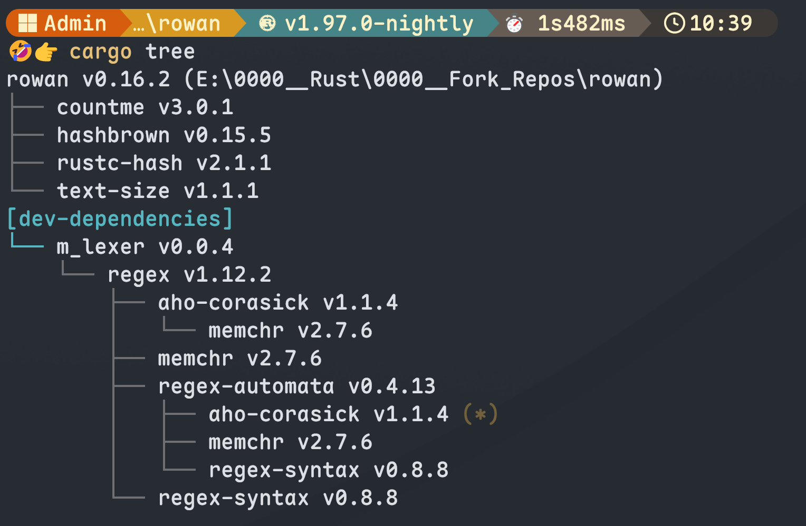
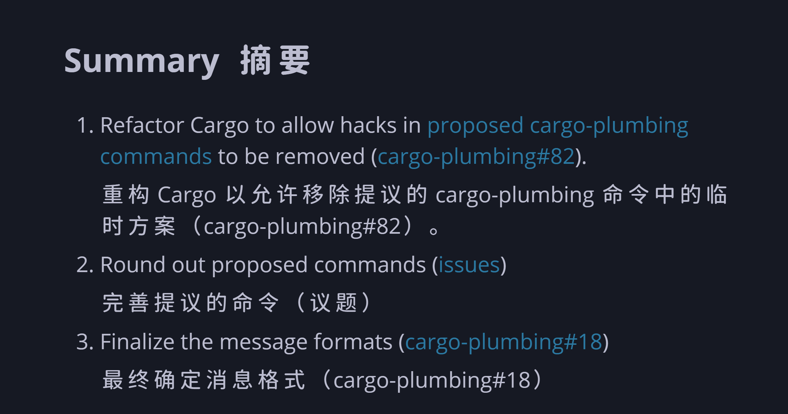
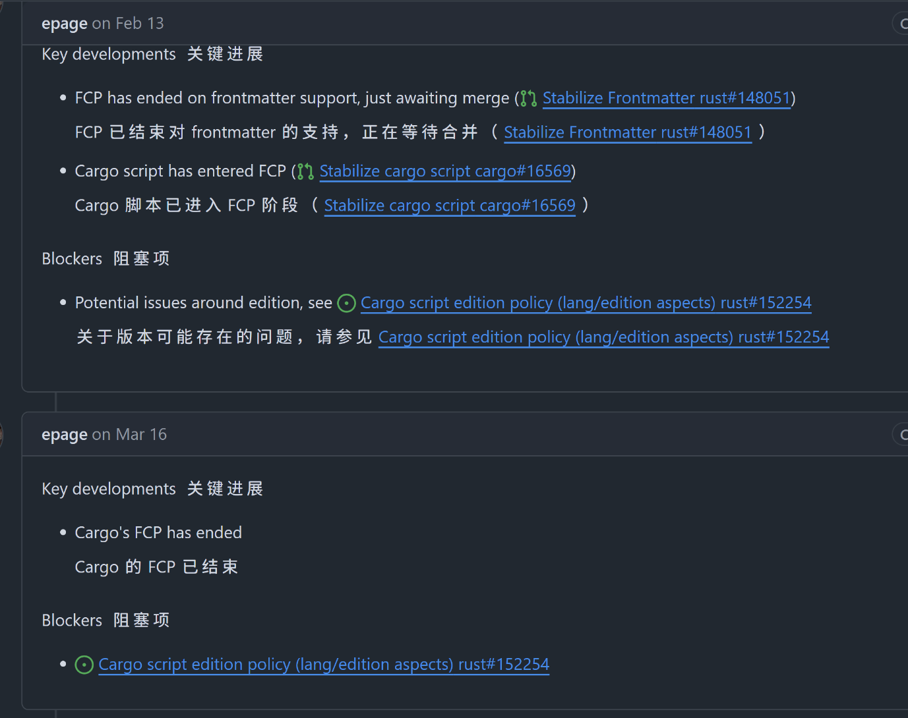
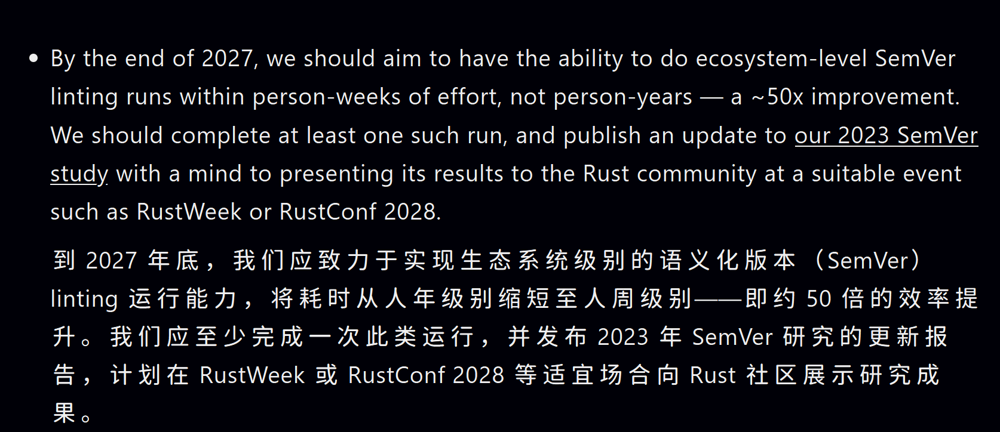

# Rust 2026 提案导读

大家好, 这里是自然选择.

2026 年 5 月 14 号 Rust 更新了 2026 年的提案状态.
同时也修改了提案发布的节奏, 由之前的半年发布一次, 修改为一年发布一次.
因此这次的提案数量相较于 25H2 有明显的增加.

Rust 2026 提案中, 25 个是 25H2 的延续提案, 同时有 41 个全新提案.
是的, 新提案数量已经和 25H2 全提案数量持平.

因此这次的解读工作量也大幅增加, 我计划以三到四期视频进行分步解读.

由于提案数量的激增, 之前使用的五种提案分类不再适用.

```md
25h2的提案分类

1. Cargo 与构建系统
2. 语言特性与人体工程学
3. 编译器内部与性能
4. 互操作性与平台生态
5. 规范、文档与测试
```

这次, 我将他们分成了十类:

基础设施主题下有:

- Cargo与Crate
- 工具链
- 平台与互操作
- 文档
- 编译与构建
- 编译器核心

语言特性主题下有:

- 变量与内存
- 易用性
- 编译期能力
- 表达力

# Cargo与Crate

## cargo-lints

作为一名rust开发者,
你肯定熟悉了那些由rustc, clippy 甚至于 rust-analyzer 提供的警告.
那紧致的包裹感让人十分安心, 也让我们参与别人的项目时更加轻松, 不会把时间浪费在不必要的代码审查上.

然而 Cargo 本身却没有提供足够的检查能力, 这会导致许多在只会出现在 Cargo.toml 里的问题无法被发现.
最常见的便是导入的库因为代码变更而未被使用.
由于目前的 Cargo 没有检查这些问题的能力, 我们不得已借助 cargo shear 等 Cargo 插件来检查这类问题.

这个提案的目标就是将已经在 nightly 中实现的 Cargo 的检查系统
优化至与 rustc 和 clippy 同等质量并稳定化.
让原生工具链能够覆盖rust项目中的方方面面, 而不仅仅是 \*.rs 代码.

## interactive-cargo-tree

理解项目依赖关系图、调试版本冲突以及分析依赖项中使用的features是 rust 项目依赖管理的常见需求.

Cargo 目前提供的 tree 指令用于输出项目的依赖树, 但其目前仅为静态工具, 缺乏交互性.

探索大型或复杂的依赖关系图十分困难, 不得不管道传递给与 grep 或 less 等工具做额外处理.

这个提案旨在通过为 tree 命令引入交互模式，提升探索依赖图的体验.
这将允许用户通过按键对依赖图执行操作.
并提供的额外功能和视觉改进，用户将能够更高效地导航和分析其依赖图.

## 其他提案

### stabilize-cargo-sbom

Software Bill of Materials是一份项目依赖项及其版本的列表，类似于 Cargo.lock
采用跨编程语言标准化的格式。它能够实现供应链透明度，并便于识别存在已知漏洞的依赖项.
在美国，第 14028 号行政命令要求联邦政府仅采购能提供每款产品软件物料清单的供应商产品。
在欧盟，《网络弹性法案》规定任何在欧盟销售的包含“数字元素”的产品必须在其技术文档中包含 SBOM

该提案解决 Cargo 的 SBOM 前驱功能中的已知问题并最终确定 RFC，推进 Cargo SBOM 支持的 MVP 版本开发进度

### cargo-plumbing (延续提案)

把 Cargo 从黑盒拆分成一系列模块化的底层命令,
让其他工具能更灵活地与 Cargo 集成.

去年本提案入选 GSoC, 因此取得了一些进展, 但目前对具体的实施方案仍处于重构当中


### cargo-script (延续提案)

现在写个最简单的 Rust 程序, 最少也得创建 `Cargo.toml` 和 `main.rs` 两个文件.
这个提案就是要让 Rust 支持 "单文件脚本", 像 Python 那样, 一个文件就能跑起来.
目前其并没有遇到过多的阻塞项, 主播预计这个提案年应该能完成


### cargo-semver-checks (延续提案)

在 `cargo publish` 的时候自动检查语义化版本,
阻止发布者做出违背语义化版本的 API 变更.
其在2025年 Lint 数量由120个增长到242个, 而lint执行时间却减为原来的四分之一.
但其任有许多工作需要完成, 作者预计可能在2028年才能正式稳定.


### open-namespaces (延续提案)

能够将项目的子模块拆成多个独立的包来发布，但依然放在同一个命名空间下.
这样任何人都不用纠结再 tokio-util 和 tokio-utils 哪个是真正的官方出品了

```toml
[dependencies]
tokio = "1.0"
"tokio::tokio-util" = "3.1"
```

作为 25h2 的延续提案, 目前 Cargo 支持已部分实现, 编译器设计也已达成一致并部分实现

### pub-priv (延续提案)

允许声明依赖库是否对外部可见.
能够防止意外暴露, 强化语义化版本检查, 同时减少文档噪音.
客户永远只需要菜单, 而不需要后厨里料酒的说明书.
这个提案年计划实现并稳定RFC中描述的公共依赖项的 MVP.

# 编译器核心

这一组提案比前面的 Cargo 功能更“底层”.
它们不一定会立刻变成某个用户可见的新语法,
但很多都直接决定了 Rust 编译器未来五到十年的上限:
借用检查器能不能更聪明, trait 系统能不能更稳, async 能不能不再又大又胖, 宏系统能不能获得真正的编译期执行能力.

## assumptions_on_binders

今天 Rust 在处理 `for<'a>` 这类 binder 时,
并不会完整记录那些和被绑定生命周期相关的 where 假设.
结果就是编译器在遇到高阶生命周期约束时, 时不时会“忘词”:
轻则报出让人摸不着头脑的错误, 重则出现真正的健全性问题.

提案里点名了两个典型例子:
一个是 async 代码里著名的 Send 相关 bug,
另一个是高阶子类型关系上的历史不健全问题.

这个提案的目标,
是把今天只在很有限场景里工作的 `-Zhigher-ranked-assumptions`,
推广成一套对所有 binder 都适用的通用机制.
如果这件事做成了,
未来很多“明明逻辑成立, 编译器却推不出来”的高阶生命周期问题,
才有机会被系统性解决.

需要注意的是,
这类工作今年不会直接给稳定版用户一个显眼的新按钮.
它更像是在给下一代 trait 系统和借用检查器提前扫雷、补地基.

## async-future-memory-optimisation

如果你写过层层嵌套的 async 组合器,
这个提案会非常有感.
Rust 的 Future 有一个存在已久的问题:
体积有时候会膨胀得非常夸张.

提案里给了个很直观的例子:
一个只捕获了 64KB 数据的 future,
在多层组合之后, 最终对象大小可以轻松冲到 1MB 级别.
这不是 benchmark 小把戏,
而是真会在服务端制造难以解释的栈溢出与额外堆分配,
也会在嵌入式、内核、实时系统里直接阻止 async Rust 落地.

这个提案准备从 future 的内存布局本身下手.
第一步是把 `-Zpack-coroutine-layout` 这样的压缩布局方案做成 nightly 可实验的能力,
先把最常见的捕获冗余压下去.

后面还会继续探索两条更激进的路线:

1. 让嵌套 future 的状态尽量内联, 统一做更聪明的布局.
2. 研究直接把 Rust coroutine 降到 LLVM coroutine intrinsic 上, 把更多优化空间交给 LLVM.

简单说,
这不是在教开发者“少写几个 `Box::pin`”,
而是在尝试让编译器自己别再把 async future 生得那么胖.

## async-statemachine-optimisation

上一个提案是在问:
“既然状态机已经生成出来了, 怎么把它塞得更紧?”

这个提案则是在问:
“很多状态机, 是不是压根就不该被生成为这么复杂?”

今天的 Rust async 会非常老实地把每个 async fn 或 async block
都翻译成一个完整状态机.
哪怕这个 future 根本没有 `await`,
或者只是简单地 `await` 另一个 future 一次,
编译器也可能先造出一个三状态机器, 然后再指望 LLVM 帮忙把它优化掉.

优化等级够高的时候, LLVM 有时确实能擦掉这些冗余;
但一旦 async 嵌套变深, 或者目标是 `-Oz` 这类偏代码体积的场景,
这些多余结构就会原样留在最终产物里.

这个提案打算直接在 coroutine 的 MIR 转换阶段做更前置的优化:

1. 没有 `await` 的 future, 不该拥有完整状态机.
2. 只有一次 `await` 的包装 future, 最好能直接“变成”被 await 的那个 future.
3. 那些几乎只会在错误执行器下触发的 panic 分支, 应该考虑是不是能用更轻的方式表达.

它和前一个提案并不是互斥关系.
前者偏“布局优化”, 这里偏“结构优化”.
一个负责把已经生成的机器压缩,
一个负责从源头少生成一些没必要的机器.

对嵌入式开发者来说, 这类优化非常实在.
提案作者给出的经验是, 某些 async 示例程序改成阻塞版之后, 二进制体积能直接腰斩.
所以这不是为了好看的 benchmark,
而是为了让 async Rust 真能塞进固件.

## dictionary-passing-style-experiment

这是本组里最“学术”, 但也可能最有后劲的提案之一.

今天 Rust 编译器在很多阶段会“事后再推一遍 trait 结论”:
类型检查时算过一次,
到了 MIR borrowck、规范化、代码生成等后续阶段,
又会按需把对应 impl 重新找一遍.

这个做法虽然大体可行,
但也把大量复杂性和 bug 空间带到了编译器后半程.
比如:
在一个环境里能证明的 trait 约束,
换到另一个上下文里也许就重新证明失败;
某些字段在类型定义处明明已经良构,
到了后面某个阶段却又得再次小心地验证一遍.

很多带 typeclass 的语言走的是另一条路:
在前面把“这个约束到底由哪个 impl 满足”一次性决定好,
然后把这份“证据”像字典一样一路传下去.
后面的阶段根本不需要再理解 trait 求解,
只要消费这份证据就行.

这个提案就是想在 rustc 里试验这种 Dictionary Passing Style.
如果成功,
trait 求解就会更像前端工作, 而不是整个编译管线反复参与的全局机制.
它有希望同时减少实现复杂度、修掉一批“换了环境就重新证明失败”的老问题,
甚至顺带改善编译时间.

当然, 难点也肉眼可见.
比如关联类型要怎么携带对应字典,
类型推断要不要分阶段,
这些都不是小修小补能解决的.

所以这个提案的价值,
不只在于“做成”,
也在于尽快搞清楚这条路到底能走多远.

## expansion-time-evaluation

很多人一听“反射”“comptime”“macro fn”, 第一反应都是语法设计.
但这个提案提醒我们:
Rust 离真正的编译期执行, 先差的不是语法, 而是编译器架构.

今天宏展开、名称解析、trait 求解之间耦合得太紧.
宏展开想知道某个类型或函数的信息,
但解析器又要求整个 crate 基本展开完才能稳定工作;
trait 求解默认还要看到当前 crate 里的所有 impl.
这导致编译器很难在“展开到一半”的时候暂停一下,
去编译并执行某个当前 crate 里的函数.

这个提案要做两件事.

第一, 给 trait 求解器加一个“受限模式”.
某些被特别标记的函数如果要在展开期运行,
它们只能看到上游 crate 的 trait impl,
看不到本 crate 还没完全展开的内容.
这样就能避免“编译期函数的执行结果反过来影响它自己的可见 impl 集合”这种循环依赖.

第二, 把现在过于一体化的 resolver 做 query 化改造.
说白了就是让编译器更像一个真正可中断、可局部求值的系统,
从而为未来的 `macro fn`、同 crate 反射,
甚至编译器内建的 C/C++ 互操作生成器铺路.

所以它短期不会给你一个新关键字,
但它可能决定 Rust 以后能不能拥有“真正现代”的编译期元编程.
另外提案也写得很明白:
这项工作目前需要资金支持, 否则很难真正推进.

## library-api-evolution

这一项虽然放在“编译器核心”这一组里,
但它解决的是标准库背后的一个长期结构性矛盾.

Rust 标准库对 API 稳定性有着极其严格的承诺.
一旦某个 API 稳定下来, 就不能再发生破坏性变更.
这当然保证了向后兼容,
但也意味着我们很难去修复那些随着时间推移显得不够完美的设计.
例如 `Command` 的 API, 或者让 `Mutex` 默认不中毒等等.

目前，想修改标准库中的稳定 API 的唯一办法是废弃旧 API 并引入一个新名字.
但这不仅让人在起名字时抓耳挠腮，而且还会给整个生态带来巨大的重构和跟进压力.

这个提案引入了 基于 Edition 的重导出 方案.
它允许同一个标准库路径在不同的 Edition 中指向不同的底层实现。
这样一来，标准库终于可以在跨越 Edition 时进行大刀阔斧的 API 演进了,
而旧代码依然可以通过旧 Edition 的规则完美向后兼容。

如果这件事最终落地,
Rust 标准库就第一次拥有了一种“既能大改 API, 又不逼整个生态立刻迁移”的官方机制.
它不只是标准库问题,
背后其实涉及编译器名称解析、edition 升级工具、rustdoc 展示方式等一整串底层配合.

## mir-move-elimination (延续提案)

这个提案要解决的是 Rust 一个很不“零成本”的现实:
值经常先在某个地方构造出来, 再被 move 到最终位置.
理论上, 编译器应该尽量把这些 move 消掉;
但在实践里, 一旦对象的地址被观察过, rustc 往往就不敢做这件事,
最后落成不少 `memcpy` 或栈到栈的复制.

MIR move elimination 的核心想法,
是修改 MIR 层面对 `move` 的语义理解.
如果一个值被 move 走了,
那块被覆盖的分配区域就应该能被视为“释放出来了”,
从而让后续局部变量有机会直接复用那段存储.
只有这样, Rust 才能把很多今天保守保留下来的拷贝真正优化掉.

它的意义不只是“快一点”.
一方面, 复制少了, 生成代码自然更漂亮;
另一方面, async 状态机里要跨 `yield` 保留下来的状态也会变少,
这又会反过来帮助 future 缩小体积.

根据 Rust 官方 2026 年 5 月 18 日发布的 2025H2 收官总结,
这个延续提案在 2026 年 4 月 3 日已经有了一个重要里程碑:
RFC 正式公开了.
而且这版 RFC 不是原样搬运旧草稿,
而是做了明显收敛:
去掉了 activation/de-activation 这样的复杂概念,
补充了 byref/byval 参数传递说明,
把表面语言变化和 MIR 语义变化拆开讲,
还重新明确了 `StorageLive` 在这套新语义里的位置.

这说明它已经从“可以聊聊的想法”,
推进到了“需要把语义边界写清楚、接受正式审阅”的阶段.

## next-solver (延续提案)

如果说上面很多提案是在换零件,
那 `next-solver` 干的事更像是在给 Rust 的 trait 系统换发动机.

它想做的不是某个局部修补,
而是彻底替换掉今天负责 trait 求解、关联类型规范化等核心工作的老实现.
这样做的收益非常大:
不仅能修掉一批拖了很多年的健全性问题,
还会解锁很多一直被卡住的特性,
比如更好的高阶约束处理、coinductive trait 语义、更多 async 和类型系统上的后续演进.

但也正因为它太核心了,
这类工作从来都不是“啪一下就稳定”.
根据 Rust 官方 2026 年 5 月 18 日发布的 2025H2 收官总结,
截至 2026 年 1 月 19 日,
这个项目当时的重点仍然是几条典型的硬仗:

1. 做性能打磨, 包括 canonicalization 清理和一些具体 PR 的微调.
2. 重新跑 crater 并继续做回归分拣.
3. 推进 cycle semantics 的规范化与未来 RFC.
4. 处理 rustdoc、MIR borrowck 以及推断传播里的兼容和健全性问题.

这类进度听上去没有“新语法上线”那么热闹,
但它其实正中要害.
trait 求解器这种东西, 真正难的从来不是“跑起来”,
而是要在全生态规模上把性能、回归、诊断、健全性一起压到可接受范围内.

而 2026 年的目标已经进一步抬高:
不是继续试用, 而是准备把 `-Znext-solver=globally` 稳定下来,
然后把旧实现真正拆掉.
如果这一仗打赢,
Rust 很多类型系统相关的历史包袱都会开始松动.

## polonius (延续提案)

Polonius 大概是编译器核心提案里,
普通 Rust 用户也最容易感知到价值的一个名字.

它要解决的, 是今天 NLL 借用检查器有时过于保守的问题.
有些代码在人眼看来明明安全,
编译器却还是会拒绝.
最典型的就是那个先 `get_mut` 再 `insert` 的 `HashMap` 模式,
以及一整类 lending iterator 写法.

Polonius 的路线也已经比前几年务实得多了.
现在的目标不是一步到位做出“最完美”的借用检查器,
而是先把一个足够有价值、而且性能上有希望站得住的 alpha 分析稳定下来.
它已经能够覆盖大量 NLL 长期拒绝、但实际上安全的模式,
同时把更激进的 flow-sensitive 能力留到后续阶段.

这个延续提案在 2025H2 的收官进展其实相当不错.
根据 Rust 官方 2026 年 5 月 18 日发布的总结:

1. 在 2026 年 1 月 30 日的更新里, 团队继续推进 opaque types、性能分析、测试扩展和 `a-mir-formality` 配套工作, 同时开始为 2026 的稳定化提案铺路.
2. 到 2026 年 2 月 28 日, 关键的性能改写 PR `#150551` 已经合并, 作者明确表示这部分“感觉已经具备可稳定化的样子”了.

这句话非常关键.
它不代表 Polonius 已经稳定,
但意味着项目已经从“长期研究原型”推进到了“真的在按稳定化清单逐项收尾”的阶段.

当然, 后面的活依然不少:
剩余的健全性问题要补,
真实世界性能还要继续验证,
CI 和测试覆盖要扩大,
还要把模型写进 `a-mir-formality` 和 Rust reference,
最后再准备稳定化报告.

不过至少现在我们终于可以比较有底气地说:
Polonius 不再只是“Rust 借用检查器未来也许会有的那个梦想版本”,
而是在朝着可交付的稳定子集真正靠近.
